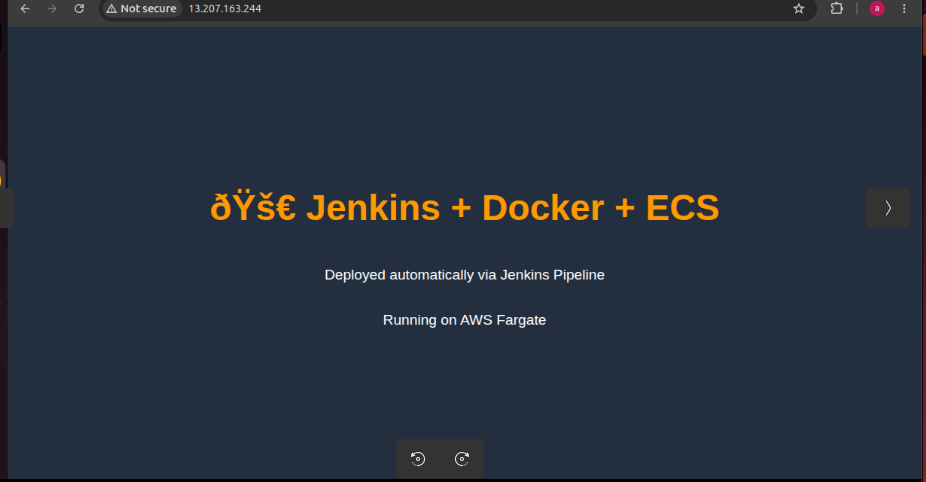
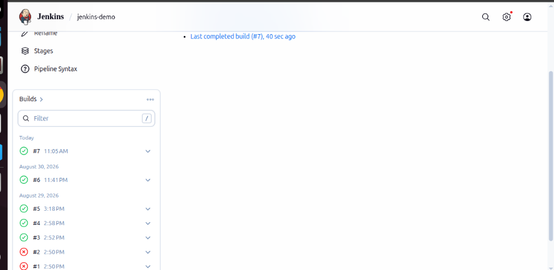
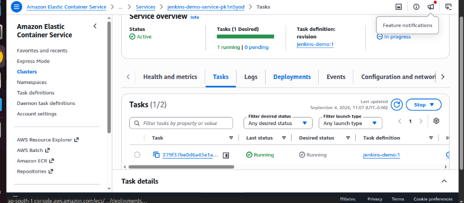

# Jenkins + Docker + ECS (Fargate) CI/CD Pipeline

A hands-on project to understand how Jenkins, Docker, Amazon ECR, and Amazon ECS Fargate work together in a real CI/CD pipeline — built locally to mirror a production-style setup.

On every push to this repository, Jenkins automatically:
1. Pulls the latest code
2. Builds a Docker image
3. Pushes the image to Amazon ECR
4. Deploys the new image to an ECS Fargate service

## Live Result



The site above is served by an nginx container running on AWS Fargate — deployed entirely through the pipeline below, with zero manual deployment steps once configured.

## Architecture

```
GitHub (this repo)
      │  git push
      ▼
Jenkins (native install, Ubuntu)
      │  reads Jenkinsfile
      ▼
Docker build  ──────────────►  Docker image (local)
      │
      ▼
Push to Amazon ECR
      │
      ▼
ECS Fargate Service  ──────►  Container running (nginx serving this site)
```

## Tech Stack

| Component | Role |
|---|---|
| **Jenkins** | Orchestrates the pipeline (build → push → deploy) |
| **Docker** | Builds the container image from the Dockerfile |
| **Amazon ECR** | Private registry storing the built images |
| **Amazon ECS (Fargate)** | Runs the container — serverless, no EC2 to manage |
| **AWS CLI** | Used inside the Jenkinsfile to authenticate and deploy (no ECR/ECS plugin needed) |
| **nginx (alpine)** | Lightweight web server serving the static site inside the container |

## Repository Structure

```
.
├── Dockerfile        # Defines the container image (nginx + static files)
├── Jenkinsfile        # Pipeline definition (checkout → build → push → deploy)
├── index.html          # Static site served by the container
├── assets/               # CSS/JS/images for the site
└── docs/                  # Screenshots referenced in this README
```

## Dockerfile

```dockerfile
FROM nginx:alpine
COPY . /usr/share/nginx/html
EXPOSE 80
```

Takes a minimal nginx image and copies the static site into nginx's web root. No build tools, no runtime dependencies — the container *is* the server.

## Jenkinsfile — Pipeline Stages

| Stage | What it does |
|---|---|
| **Checkout** | Pulls the latest code from this GitHub repo |
| **Build Docker Image** | Runs `docker build` using the Dockerfile above |
| **Push to ECR** | Authenticates with ECR via AWS CLI, tags the image with both the Jenkins build number and `latest`, and pushes both |
| **Deploy to ECS** | Runs `aws ecs update-service --force-new-deployment` so ECS pulls the new image and replaces the running task |



## AWS Infrastructure

Built manually via the AWS Console for learning purposes (not yet converted to Terraform):

- **ECR repository** — stores every image Jenkins pushes, tagged by build number
- **ECS Cluster** (Fargate launch type — serverless, no EC2 instances)
- **Task Definition** — describes the container: image, CPU/memory, port 80
- **ECS Service** — keeps 1 task running at all times, handles rolling deployments
- **Security Group** — inbound rule opened on port 80 for HTTP access




